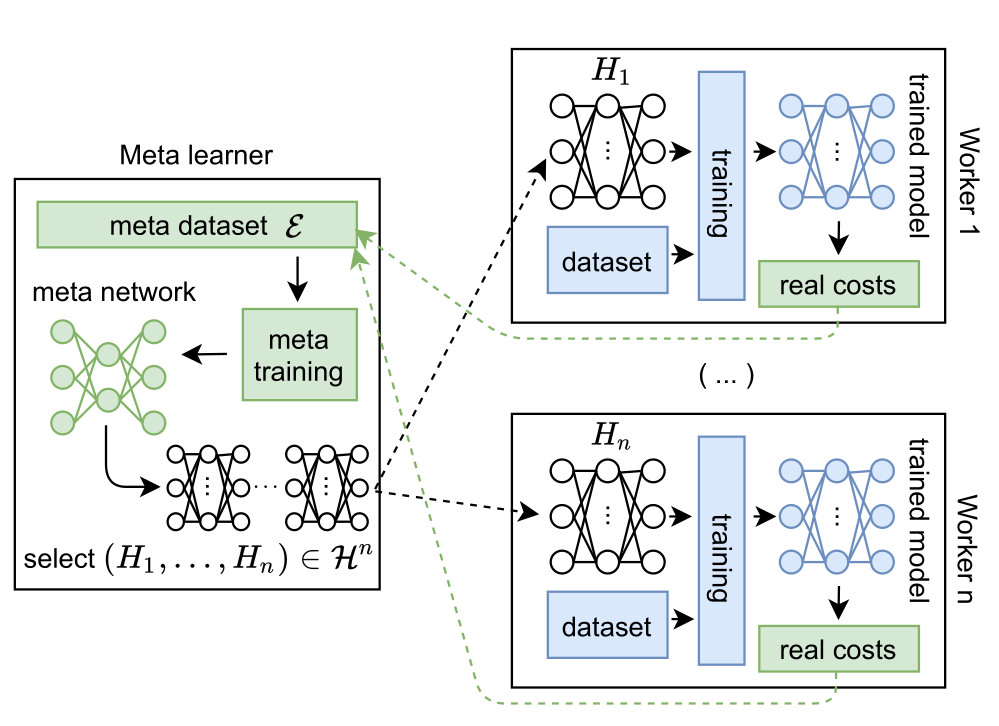

# Portiloop training



## Quick start guide

- clone the repo
- cd to the root of the repo (i.e., the folder where `setup.py` is)
- pip install with the -e option:
```terminal
pip install -e .
```
- download the [datasets.zip](https://github.com/nicolasvalenchon/Portiloop/releases/download/v0.0.2/dataset.zip) and the [experiments.zip](https://github.com/nicolasvalenchon/Portiloop/releases/download/v0.0.2/experiments.zip) files
- unzip the `datasets.zip` file and paste its content under `Portiloop>portiloop_software>dataset`
- unzip the `experiments.zip` file and paste its content under `Portiloop>portiloop_software>experiments`

### Simulation:
The `simulate_Portiloop_1_input_classification.ipynb` [notebook](https://github.com/nicolasvalenchon/Portiloop/blob/main/notebooks/simulate_Portiloop_1_input_classification.ipynb) enables performing inference and analyzing the real-time performance of the neural network in terms of stimulation.
This notebook can be executed with `jupyter`.

### Offline inference:
We enable easily using out trained artificial neural network on your own data to detect sleep spindles (note that the data must be collected in the same experimental setting as MODA for this to work, see [our paper](https://arxiv.org/abs/2107.13473)).

This is easily done by writing your signal in a simple text file, on the model of the `example_data_not_annotated.txt` file provided in the `datasets.zip` file.

Importantly, note that your signal needs to be preprocessed with our `matlab` script to ensure the sampling frequency is 250Hz and to simulate the `Portiloop` online filtering operations. Please adapt and execute [this script](https://github.com/Portiloop/portiloop-training/blob/main/portiloop_software/matlab/preprocess_unannotated_data.m).

The output file can then be directly used for inference in our `offline_inference` [notebook](https://github.com/nicolasvalenchon/Portiloop/blob/main/notebooks/offline_inference.ipynb).

### Training:
Functions used for training are defined in python under the `portiloop_software` folder.
We provide [bash scripts examples](https://github.com/nicolasvalenchon/Portiloop/releases/download/v0.0.2/scripts.zip) for `SLURM` to train the model on HPC systems.
Adapt these scripts to your configuration.
Your training curves can be visualized in real time easily using [wandb](https://wandb.ai/portiloop) (the code is ready, you may adapt it to your project name and entity).
